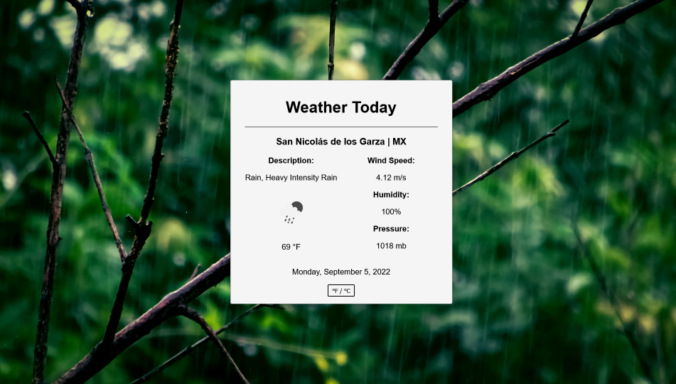

# Weather App

Created using the [Open Weather API](https://openweathermap.org/api), thanks!.  
Check out my app running on netlify here: <a href="https://tourmaline-fudge-61a3b2.netlify.app/" target="_blank">Weather App</a>

## Screenshots



## Features

- Dinamic Background
- Change units for the temperature
- Loading screen
- API consume

## Run Locally

Clone the project

```bash
  git clone https://github.com/MarceloGtz/Weather-App.git
```

Go to the project directory

```bash
  cd Weather-App
```

Install dependencies

```bash
  npm install
```

Start the server

```bash
  npm run dev
```

## Tech Stack

- Html 5
- Css 3
- JavaScript
- React
- JSON
- API

## Acknowledgements

- [Readme Editor](https://readme.so/es)
- [Open Weather API](https://openweathermap.org/api)
